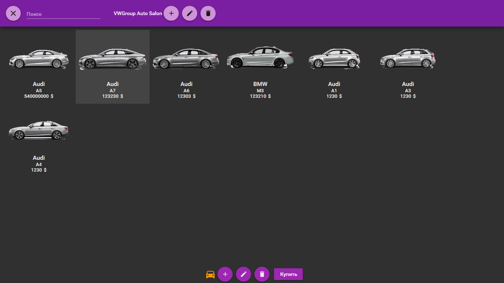
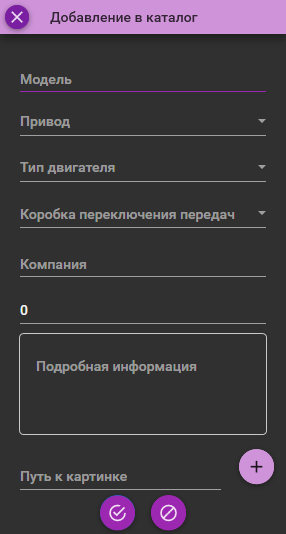
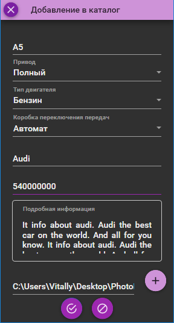
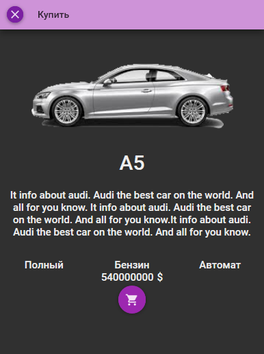
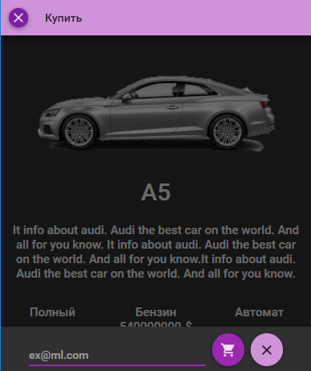

# Auto-salon

> Информационая система автосалона, предназначена для администраторов(локальная версия).

###

>Предоставляет возможность работы с базой данных автомобилей, вести каталог.

###

>Уведомлять покупателя, о его покупке при помощи почты.

###

>Используются: фреймворк Material Design WPF, SQLite, паттерн разработки MVVM.

###

# Скриншоты к программе:

## Главное меню

## Добавление

## Изменение

## Покупка

